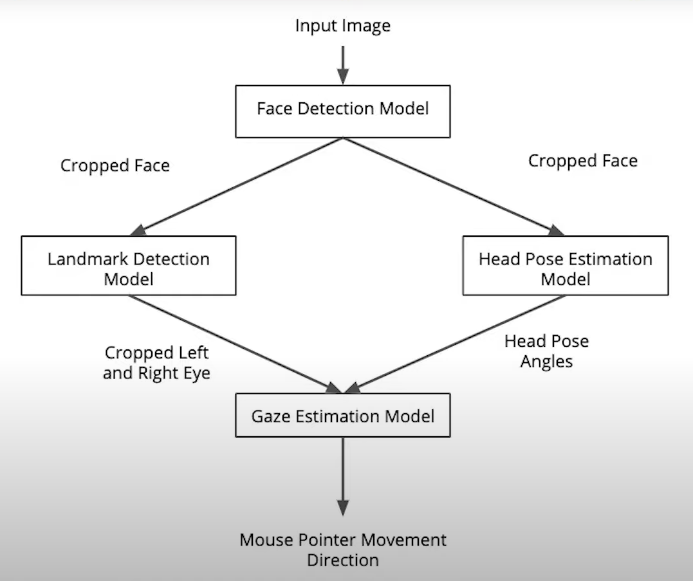
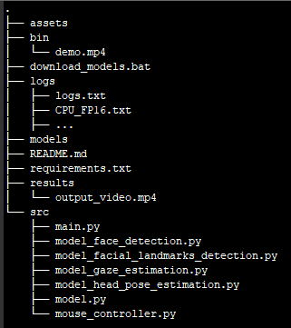

# Cursor Controller

| Details               |               |
|-----------------------|---------------|
| Programming Language: |   Python 3.6  |


This application estimates a person's gaze direction from a video file or webcam feed, and moves a computer cursor accordingly. This could be used, for example, by a physically-impaired person who wants to naviguate on a computer without using a mouse. The app uses the Inference Engine included in the Intel® Distribution of OpenVINO™ Toolkit.

This is the gaze estimation pipeline:



A first model detects faces in each frame. A second model detects the facial landmarks from the previous face detection, and a third model estimates the head pose also from the previous face detection. The images of the person's left and right eye are fed to a final model, along with the head pose estimation, to finally estimate the person's gaze direction.


## Project Set Up and Installation

- Install OpenVINO for [Windows](https://docs.openvinotoolkit.org/latest/_docs_install_guides_installing_openvino_windows.html), [Linux](https://docs.openvinotoolkit.org/latest/_docs_install_guides_installing_openvino_linux.html) or [macOS](https://docs.openvinotoolkit.org/latest/_docs_install_guides_installing_openvino_macos.html)
- Source OpenVINO environment variables: 
    - Windows: ```"C:\Program Files (x86)\IntelSWTools\openvino\bin\setupvars.bat"```
    - Linux: ```source /opt/intel/openvino/bin/setupvars.sh -pyver 3.6```
- Create and activate a virtual environment with Python 3.6
- Install the project requirements by running ```pip install -r requirements.txt```
- Download the pre-trained models in the ```models/``` folder by running ```download_models.bat``` from the root directory


## Demo

To make sure your installation is successful, run the demo:
```python src/main.py -i "bin\demo.mp4" -o True```

An ```output_video.mp4``` file will be created in the ```results/``` folder with the face and facial landmarks detections drawn over the video.

A ```logs.txt``` file will be created in the ```logs/``` folder with info-level logs (eg: multiple faces detected, no face detected).

A ```<device>_<precision>.txt``` file will also be created in the ```logs/``` folder with the following statistics:
- Total time to run the inference on the input
- Frames per second
- Total time to load the models. 

The directory tree should look like this:




## Documentation

The command line arguments are as follow:
- i: Path to video file or "CAM" for webcam (required)
- m: Path to models folder ("models/intel" by default)
- d: Target device to infer on: CPU, GPU, FPGA or MYRIAD (CPU by default)
- p: Precision of the Intermediate Representation models (FP32 by default)
- pt: Probability threshold for face detections filtering (0.5 by default)
- o: Whether to generate an annotated output video or not (False by default)

For example, you could run: ```python src/main.py -i "CAM" -m "models/test" -d GPU -p FP16 -pt 0.8 -o True```

## Benchmarks

Here are the benchmarks results of running the app with multiple hardwares and multiple model precisions. 

On CPU:
| Statistic/Precision       |       FP32       |       FP16       |       FP32-INT8       |
|---------------------------|------------------|------------------|-----------------------|
| Inference time (in secs): |       63.22      |        63.01     |         62.64         |
| Frames per second:        |        9.43      |         9.46     |          9.51         |
| Loading time (in secs):   |        0.41      |         0.44     |          1.54         |

On GPU:
| Statistic/Precision       |       FP32       |       FP16       |       FP32-INT8       |
|---------------------------|------------------|------------------|-----------------------|
| Inference time (in secs): |       76.67      |       73.87      |         74.29         |
| Frames per second:        |        7.77      |        8.07      |          8.02         |
| Loading time (in secs):   |       33.34      |       33.82      |         39.09         |


## Results

The time to load the models on a GPU is significantly longer than on a CPU, so CPUs are the preferred hardware when running the app on a live webcam feed, where no delay at the beginning would be acceptable. Since the app is only handling one video at a time and the benefit of GPU parallelism isn't needed, CPUs are also the more performant hardware in terms of inference time when running the app on a video file. 

As far as model precision goes, the faster models (low inference time) on CPU are FP32-INT8, FP16 and FP32 in that order. On GPU, the faster models are FP16, FP32-INT8 and FP32 in that order. 


## Edge Cases

If there are multiple faces or no face detected, the mouse pointer will stop moving until only one face is detected.


## Future improvements
* use Async Inference to improve performance
* benchmark the running times of different parts of the preprocessing and inference pipeline and let the user specify the CLI argument if they want to see the benchmark timing. Use the get_perf_counts API to print the time it takes for each layer in the model
* use the VTune Amplifier to find hotspots in your Inference Engine Pipeline
* add a toggle to the UI to shut off the camera feed and show stats only. How does this affects performance and power?